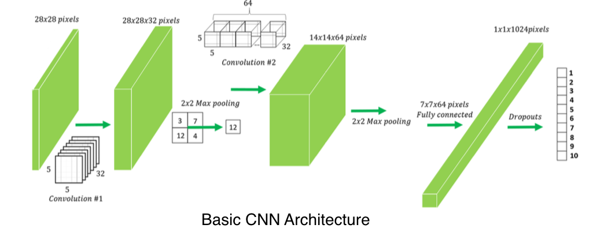

# Human Safety Using Deep Learning

## Contents

1. [Motivation](#Motivation)
2. [Proposed Solution](#Proposed-Solution)
3. [CNN](#Convolution-Neural-Networks-with-Fully-Connected-Layers)
4. [YOLO](#YOLO-Model)
5. [Results](#Results)
6. [Conclusion](#Conclusion)
7. [Future Work](#Future)
8. [References](#References)

## Motivation

	

## Proposed Solution

### Classification

	

### Detection

	

## Convolution Neural Networks with Fully Connected Layers

### Data

The CIFAR-100 dataset consists of 60000 32x32 colour images in 20 main classes. There are 50000 training images and 10000 test images. The dataset is created for educational and research purposes and require less computation cpu compatible calculations. It was used for Human Classification task because of small images and thus less computation

	

	

### Model

	

	

## YOLO Model

### Data

PASCAL VOC provides standardised image data sets for object class recognition. Enables evaluation and comparison of different methods. New images were added in different version of VOC over the years for facilitating different fields of research

### Model

• YOLO divides an input image in 13x13 sub-images 
• A total of 169 boxes are created over the input image 
• Each of the box is responsible for detecting upto 5 bounding boxes by running the patch through architecture and getting the classification output from last convolution layer
  
The output of YOLO algorithm is an image containing bounding boxes around objects of interest and the confidence score of each detected object.
 

	

## Results

	

	

	

	

	

## Conclusion

The models implemented in this project successfully accomplished the task of detection of humans in an image. The first model was a convolutional neural network (CNN) architecture which is used for classification of an image based on presence of human in it. This model was biased specifically for detecting humans. This model successfully predicted presence of humans in an input image. The next model implemented was a YOLO architecture. Pre-trained weights available at Darknet was used instead of training the model from scratch. This was done due to unavailability of high computational power and sophisticated hardware. The result was an output image containing bounding boxes around humans present in image. This system helps in localising the portion in image containing humans. This was the central idea of doing this project, which is successfully achieved.

## Future Work

Future works includes use of larger dataset to bridge the gap between train accuracy and validation accuracy. Data augmentation techniques like flipping, rotation and addition of noise can be applied to further improve the results. The proposed model can be trained on new dataset containing images of large size for better results on images containing humans in various poses and posture.  
Segmentation techniques can be further applied to get the exact mask of portion containing humans. This will add a new degree of accuracy to the proposed architecture by providing the exact boundary containing human. Instance segmentation can be further applied to distinguish between different humans present as a group in image. This will further enhance the segmentation output by providing the segmentation mask as well as the exact count of humans.

	

## References

[1]	Jurgen Schmidhuber, *“Deep Learning in Neural Networks: An Overview,”* cIstituto Dalle Molle di Studi sull’Intelligenza Artificiale, 2014 
[2]	Yann LeCunn, Yoshua Bengio & Geoffrey Hinton, *“Deep Learning,”* Nature, May 2015 
[3]	Paul Viola and Michael Jones, *“Rapid Object Detection using a Boosted Cascade of Simple Features,”* conference on Computer Vision and Patter Recognition, 2001 
[4]	N. Dalal and B. Triggs, *“Histograms of oriented gradients for human detection,”* IEEE Computer Society Conference, 2005 
[5]	Alex Krizhevsky, Ilya Sutskever and Geoffrey E. Hinton, *“ImageNet Classification with Deep Convolutional Neural Networks,”* NIPS 
[6]	Joseph Redmon, Santosh Divvala, Ross Girshick, Ali Farhadi, *“You Only Look Once: Unified, Real-Time Object Detection,”* arXiv:1506.02640v5, May 2016 
[7]	Nitish Srivastava, Geoffrey Hinton, Alex Krizhevsky, Ilya Sutskever, Ruslan Salakhutdinov, *“Dropout: A Simple Way to Prevent Neural Networks from Overfitting,”* Journal of Machine Learning Research, 2014 
[8]	Olaf Ronneberger, Philipp Fischer, Thomas Brox, *“U-Net: Convolutional Networks for Biomedical Image Segmentation,”* accepted at MICCAI 2015 
[9] Vijay Badrinarayanan, Alex Kendall, Roberto Cipolla, *"SegNet: A Deep Convolutional Encoder-Decoder Architecture for Image Segmentation"*, arXiv:1511.00561v3, 10 Oct 2016