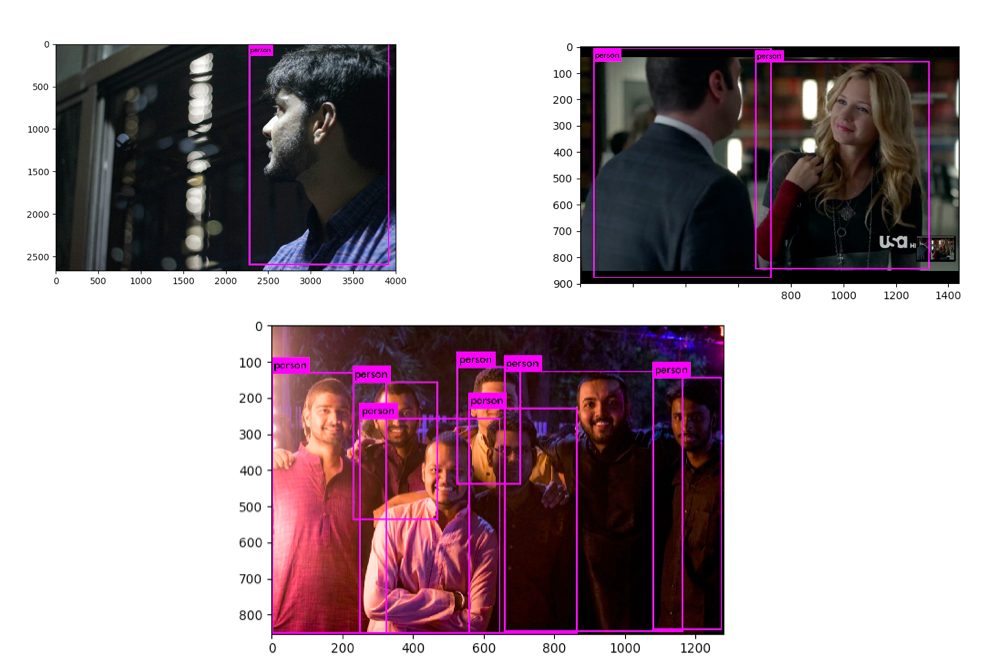
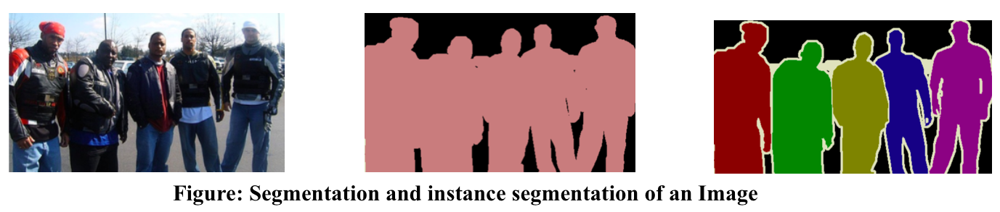

# Human Safety Using Deep Learning

## Contents

1. [Motivation](#Motivation)
2. [Proposed Solution](#Proposed-Solution)
3. [CNN](#Convolution-Neural-Networks-with-Fully-Connected-Layers)
4. [YOLO](#YOLO-Model)
5. [Results](#Results)
6. [Conclusion](#Conclusion)
7. [Future Work](#Future)
8. [References](#References)

## Motivation

Human Detection is one of the major concern in any new development and application. Self-driving cars are being developed to increase human comfort in driving. The algorithm in these cars are trained on massive datasets and under a variety of conditions to provide human-like driving experience to users. Autonomous drones are also being developed to uplift the ease in delivery systems and other uses. Automatic surveillance uses specialised Artificial Intelligence algorithms to provide safety and security in public areas. Some military vehicles and systems also uses cameras to  fire automatically and keep intruders away. New humanoid robots and machines are developed by researchers at rapid rate to assist humans in everyday work and to carry out difficult tasks. An example of this is bomb-disposal squad in which robots can be used to avoid casualties
 

	

 
In all the use cases mentioned above, humans are of primary concern and has to be dealt separately. A self-driving vehicle must be trained implicitly to avoid hitting humans, among other objects since a collision with tree causes much less casualty than a collision with another human. Same is the case with other cases mentioned. If a humanoid robot fail to detect humans in its vicinity, it might harm the subject unknowingly  
Human Detection thus becomes a vital topic to work upon. A machine perceives outside world mainly with cameras. We propose methods to classify and detect humans in an image containing multiple objects like trees, lakes, mountains, vehicles etc. We propose to use the new and emerging field of Deep Learning to accomplish this task. Deep learning has proven its capabilities in providing state-of-art results compared to conventional methods. We use CIFAR-100 dataset to train a Convolutional Neural Network (CNN) to perform classification task. The model is able to detect humans in an image containing different objects. The model is biased to detect humans accurately and the test set accuracy obtained on human images was 98.59%. Next, we propose to use YOLO model architecture with its pre-trained weights available on Darknet for detection. This model is one of a kind which creates rectangular bounding boxes around human subjects in an image containing multiple objects. The proposed future works in this regard includes Human Segmentation and Instance Segmentation

## Proposed Solution

We propose a Deep Learning based approach for Human Classification and Detection task. Deep learning approaches have earlier proved to provide state of art result in many common tasks performed easily by humans. These tasks include speech recognition, gesture recognition, text-to-speech conversion, language translation etc. One of the major task in this regard is Human Detection, which is the most vital subset of Object Detection task. Object Detection involves classification of objects into different categories and detecting the region in which the object is contained in image. We first focus on classification task in which we classify whether an image contains a human or not. Next, we focus on detection task which deals with drawing a bounding box around humans present in the input image

### Classification

	

### Detection

	

## Convolution Neural Networks with Fully Connected Layers

Object classification deals with classifying an image as positive or negative, depending upon whether a particular object is contained in image or not. This acts as the first step in human detection. The proposed model takes any image as input and give binary output based on presence of humans in the input image. A Convolutional Neural Network is used to train the model on CIFAR-100 dataset

### Data

The CIFAR-100 dataset consists of 60000 32x32 colour images in 20 main classes. There are 50000 training images and 10000 test images. The dataset is created for educational and research purposes and require less computation cpu compatible calculations. It was used for Human Classification task because of small images and thus less computation

	

The train file in dataset contains a one-dimensional array for each image. The first task in preprocessing data was to convert the one-dimensional array into RGB images. The image size of each image is 32x32 and every image contains 3-channels. Hence the length of each 1-d array is 32x32x3 = 3072. Among these 3072 pixel values, first 1024 values represents red channel, next 1024 represents green and the last 1024 represents blue channel. The images in 1-d array was reshaped into 3x1024 tensors which was further converted into 3x32x32 matrix. The axes of these matrix was transposed by required amount to create the RGB image with proper 32x32x3 shape. The process to read data from train.txt file in CIFAR-100 dataset is described above and the same is depicted in image below

	

The images read above is saved as jpg images in a Data Original folder for further processing. The images are also categorised in folders based on label name and saved to DataCat folder to ease processing. Since the computational power of our machine which is used for training is limited, 1000 images of each category is copied to a new folder. For training our model to specifically detect humans, the dataset was biased with additional 2910 images of humans from the dataset. The final Data folder for training contained 22910 images with their corresponding labels. A csv file containing the name of images and corresponding labels is created to ease the training process. The csv file was shuffled to make the occurrence of images random and thus remove any unintentional bias. The steps defined above were the preprocessing steps taken to convert the raw data file into usable format. The dataset is divided into 80% training images and 20% test images. Among the 80% train images, 10% of the images is used as validation set.

### Model

The model consists of a series of convolutional and max-pooling layers followed by a few dense layers which gives the output. The convolutional layer is used for feature extraction. Padding is used to preserve the size of inputs and outputs to convolutional layer. Max-pooling layer is used to reduce the feature vector size after each convolution layer, thus reducing the number of parameters to be processed in subsequent layers. The use of max-pooling layers to reduce the number of parameters reduces the number of computations required. Batch Normalisation layer is used normalise weights after the corresponding layers. This provides generalisation and produces similar validation and train results. To further enhance generalisation, dropout layer is used to randomly switch off some nodes in correspondence with the blocking probability specified. Rectified Linear Units are used as activation function for all except the last layer. The last layer uses Softmax activation function. It has 20 nodes as output, with each node describing the probability of output being the corresponding layer
  
The work flow of the classification model when an image is given as input is shown below

	

The hyper-parameters for the classification model explained above is shown below

	

## YOLO Model

You Only Look Once(YOLO) is a state-of-art, real time object detection system. Unlike Classification model, YOLO does not contain a fully connected layer at the end. YOLO is used for both, classification as well as detection. It gives the confidence score to each of the predicted class. YOLO is just a very big stack of convolution layers which creates dense feature vector for object detection

### Data

PASCAL VOC provides standardised image data sets for object class recognition. Enables evaluation and comparison of different methods. New images were added in different version of VOC over the years for facilitating different fields of research

### Model

• YOLO divides an input image in 13x13 sub-images 
• A total of 169 boxes are created over the input image 
• Each of the box is responsible for detecting upto 5 bounding boxes by running the patch through architecture and getting the classification output from last convolution layer
  
The output of YOLO algorithm is an image containing bounding boxes around objects of interest and the confidence score of each detected object.
 

	

## Results

The graphs below shows the variation of training and validation accuracy and loss as the number of epochs increased

	

Below are some sample images from test set. Some of the images are random images(images not present in the test set)

	

	

The results obtained on test set for classification model is shown below

	

The figure shows the result of YOLO detection model for human detection on our sample data

	

## Conclusion

The models implemented in this project successfully accomplished the task of detection of humans in an image. The first model was a convolutional neural network (CNN) architecture which is used for classification of an image based on presence of human in it. This model was biased specifically for detecting humans. This model successfully predicted presence of humans in an input image. The next model implemented was a YOLO architecture. Pre-trained weights available at Darknet was used instead of training the model from scratch. This was done due to unavailability of high computational power and sophisticated hardware. The result was an output image containing bounding boxes around humans present in image. This system helps in localising the portion in image containing humans. This was the central idea of doing this project, which is successfully achieved.

## Future Work

Future works includes use of larger dataset to bridge the gap between train accuracy and validation accuracy. Data augmentation techniques like flipping, rotation and addition of noise can be applied to further improve the results. The proposed model can be trained on new dataset containing images of large size for better results on images containing humans in various poses and posture.  
Segmentation techniques can be further applied to get the exact mask of portion containing humans. This will add a new degree of accuracy to the proposed architecture by providing the exact boundary containing human. Instance segmentation can be further applied to distinguish between different humans present as a group in image. This will further enhance the segmentation output by providing the segmentation mask as well as the exact count of humans.

	

## References

[1]	Jurgen Schmidhuber, *“Deep Learning in Neural Networks: An Overview,”* cIstituto Dalle Molle di Studi sull’Intelligenza Artificiale, 2014 
[2]	Yann LeCunn, Yoshua Bengio & Geoffrey Hinton, *“Deep Learning,”* Nature, May 2015 
[3]	Paul Viola and Michael Jones, *“Rapid Object Detection using a Boosted Cascade of Simple Features,”* conference on Computer Vision and Patter Recognition, 2001 
[4]	N. Dalal and B. Triggs, *“Histograms of oriented gradients for human detection,”* IEEE Computer Society Conference, 2005 
[5]	Alex Krizhevsky, Ilya Sutskever and Geoffrey E. Hinton, *“ImageNet Classification with Deep Convolutional Neural Networks,”* NIPS 
[6]	Joseph Redmon, Santosh Divvala, Ross Girshick, Ali Farhadi, *“You Only Look Once: Unified, Real-Time Object Detection,”* arXiv:1506.02640v5, May 2016 
[7]	Nitish Srivastava, Geoffrey Hinton, Alex Krizhevsky, Ilya Sutskever, Ruslan Salakhutdinov, *“Dropout: A Simple Way to Prevent Neural Networks from Overfitting,”* Journal of Machine Learning Research, 2014 
[8]	Olaf Ronneberger, Philipp Fischer, Thomas Brox, *“U-Net: Convolutional Networks for Biomedical Image Segmentation,”* accepted at MICCAI 2015 
[9] Vijay Badrinarayanan, Alex Kendall, Roberto Cipolla, *"SegNet: A Deep Convolutional Encoder-Decoder Architecture for Image Segmentation"*, arXiv:1511.00561v3, 10 Oct 2016